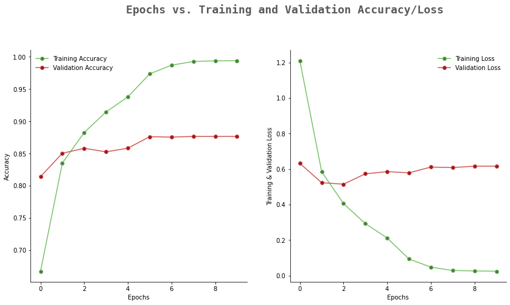

<h2 style="margin-top:67px;">Présentation</h2>
  
 La classification de produit dans le domaine du e-commerce. L’objectif étant de cataloguer les produits en utilisant différents types de
données, en l’occurrence des données textes et des données images. Ceci constitue un véritable enjeu dans le domaine du e-commerce car la classification des produits permet de réaliser des applications diverses telles que la recommandation de produits et la recherche personnalisée. Il s’agit donc de prédire le code type des produits sachant des données textuelles (désignation et description des produits) ainsi que des données images (image du produit). L’approche multimodale est une technique utile pour les entreprises de commerce électronique car elles ont du mal à catégoriser les produits en fonction des images et des étiquettes des marchands et à éviter les doublons, en particulier lors de la vente de produits neufs et d'occasion de marchands professionnels et non professionnels.

<h2>Exploration et visualusation des données</h2>

Pour ce challenge, Rakuten France met à disposition des données sur environ 99000
produits comprenant 84916 produits pour les données d’entrainement et 13812 pour les
données test. Les données sont sous deux formats :
Données CSV :

<b class="term">Trois fichiers csv sont fournis</b> :
<ul>
  <ol>
      <li>
        X_train.csv: qui est le fichier descriptif des images d’entrainement. Il contient les données sur : la désignation du produit, la description du produit, l’identifiant de l’image associée (imageid), l’identifiant du produit (productid)
      </li>
      <li>
        Y_train.csv: contient le code type des produits listés dans X_train (produits utilisés pour l’entrainement)
      </li>
      <li>
        X_test.csv: qui est le fichier descriptif des images d’entrainement. Il contient les mêmes données que le fichier X_train.csv
      </li>
  </ol>
</ul>

L’objectif est de prédire le fichier Y_test.csv qui contiendra le code type des produits listés dans X_test (produits utilisés pour le test)

Les images sont fournies dans deux répertoires séparés</b> :
<ul>
  <ol>
    <li>
      image_training : qui contient les 84916 images pour l’entrainement
    </li>
    <li>
      image_test : qui contient les 13812 images pour le test
    </li>
  </ol>
</ul>

L'ensemble des fichiers sont regroupés dans le DataFrame suivant :

En termes de volume, les données textuelles font environ 60 mb et les données d’images
environ 2.2Gb pour 27 classes de produits représentées ci-dessous.

<table class="table">
    <thead>
      <tr>
        <th>Catégorie</th>
        <th>Type</th>
        <th>Labels</th>
      </tr>
    </thead>
    <tbody class="section section-step">
      <tr>
        <td rowspan = "5">livres</td>
        <td>Livres type romain, Couvertures de livres</td>
        <td>10</td>
      </tr>
      <tr>
        <td>Livres, journaux et revues anciennes</td>
        <td>2280</td>
      </tr>
      <tr>
        <td>Livres, BD et revues de collection</td>
        <td>2403</td>
      </tr>
      <tr>
        <td>Livres en général</td>
        <td>2705</td>
      </tr>
      <tr>
        <td>Cahiers, carnets, marque pages</td>
        <td>2522</td>
      </tr>
    </tbody>
    <tbody class="section section-step">
    <tr>
      <td rowspan = "5">Jeux</td>
      <td>Jeux videos, CDs + mais aussi equipements, cables, etc.</td>
      <td>40</td>
    </tr>
    <tr>
      <td>Equipements/complements consoles, gamers</td>
      <td>2905</td>
    </tr>
    <tr>
      <td>Jeux vidéos pour PC</td>
      <td>2462</td>
    </tr>
    <tr>
      <td>Equipement jeux, jeux video, play stations</td>
      <td>50</td>
    </tr>
    <tr>
      <td>Consoles</td>
      <td>60</td>
    </tr>
    </tbody>
    <tbody class="section section-step">
    <tr>
      <td rowspan="6">Jouets & Figurines</td>
      <td>Jouets pour enfants, poupées nounours, equipements enfants</td>
      <td>1280</td>
    </tr>
    <tr>
      <td>Jeux socitété pour enfants, Boites et autres, couleurs flashy</td>
      <td>1281</td>
    </tr>
    <tr>
      <td>Jeux techniques, Voitures/drones télécomandés, Equipement, petites machines</td>
      <td>1300</td>
    </tr>
    <tr>
      <td>Figurines et boites</td>
      <td>1180</td>
    </tr>
    <tr>
      <td>Figurines, Personnages et objets, parfois dans des boites</td>
      <td>1140</td>
    </tr>
    <tr>
      <td>Cartes collectionables, Rectangles, beaucoup de couleurs</td>
      <td>1160</td>
    </tr>
    </tbody>
    <tbody class="section section-step">
    <tr>
      <td rowspan="2">Meubles</td>
      <td>Matériel et meubles bébé poussettes, habits</td>
      <td>1320</td>
    </tr>
    <tr>
      <td>Meubles, matelas canapés lampes, chaises</td>
      <td>1560</td>
    </tr>
    </tbody>
    <tbody class="section section-step">
    <tr>
      <td rowspan="5">Equipements</td>
      <td>Matériel, meubles et outils pour le jardin</td>
      <td>2582</td>
    </tr>
    <tr>
      <td>Equipements technique pour la maison et exterieur (piscines), produits</td>
      <td>2583</td>
    </tr>
    <tr>
      <td>Idem 2583:  Equipements technique pour la maison et exterieur (piscines), produits</td>
      <td>2585</td>
    </tr>
    <tr>
      <td>Equipements, Habits, outils, jouets, objets sur fond blanc</td>
      <td>1302</td>
    </tr>
    <tr>
      <td>Equipements divers pour animaux</td>
      <td>2220</td>
    </tr>
    </tbody>
    <tbody class="section section-step">
    <tr>
      <td rowspan="2">Déco</td>
      <td>Oreillers, coussins, draps</td>
      <td>1920</td>
    </tr>
    <tr>
      <td>Décorations</td>
      <td>2060</td>
    </tr>
    </tbody>
    <tbody class="section section-step">
    <tr>
      <td rowspan="2">Autre</td>
      <td>Chaussetes bébés, petites photos</td>
      <td>1301</td>
    </tr>
    <tr>
      <td>Alimentations, conserves boites d gateaux</td>
      <td>1940</td>
    </tr>
    </tbody>
  </table>

Comme toutes données en data science, un pretraitement est necessaire. En resume ici, nétoyage du texte et  ajout du chemin des images dans le DataFrame ce qui donne :
 

La figure ci-dessous montre la distribution des produits sur l’ensemble des 27 classes. On constate que certaines classes sont plus représentées que d’autres.
<image src="images/distribution_labals.png">

<h2>Classification</h2>

Le problème de machine learning traité dans ce cadre est un problème de classification multimodal supervisée. Il s’agit de partir de données de deux formats différents (textes et images) avec les classes associées et d’apprendre à partir de ces données un modèle de classification pour tout produit.Ce modèle permettra à partir de l’image d’un produit, sa désignation et sa description de prédire son code type. Ce modèle de classification permet de réaliser des applications diverses telles que la
recommandation de produits et la recherche personnalisée dans les plateformes e-commerce. Un modèle concactiné Bert et ResNet obtient l'accurnce suivante :
<!-- 
 -->

       